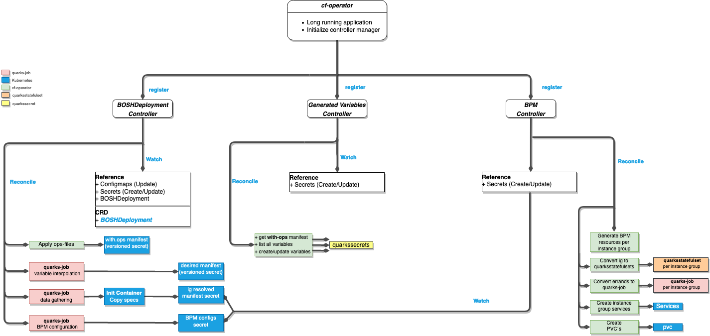
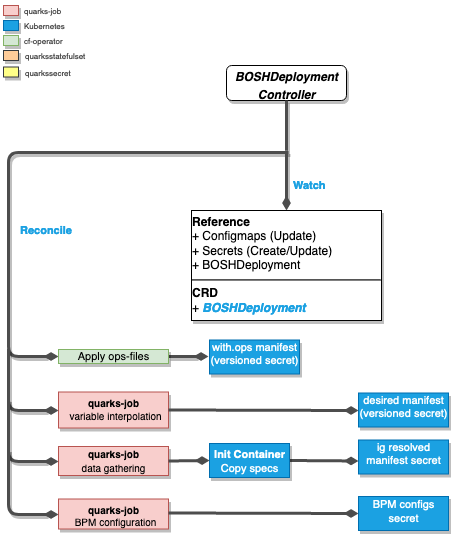
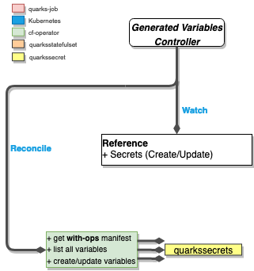
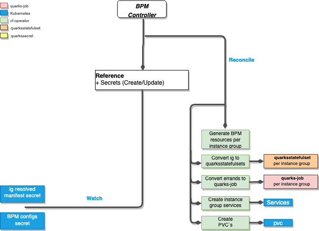

# BOSHDeployment

- [BOSHDeployment](#boshdeployment)
  - [Description](#description)
  - [BDPL Component](#bdpl-component)
    - [BOSHDeployment Controller](#boshdeployment-controller)
    - [Generate Variables Controller](#generate-variables-controller)
    - [BPM Controller](#bpm-controller)
  - [BDPL Abstract view](#bdpl-abstract-view)
  - [BOSHDeployment resource examples](#boshdeployment-resource-examples)

## Description

A BOSH deployment is created from a deployment manifest and optionally ops files.

The deployment manifest is based on a vanilla BOSH deployment manifest.
The ops files modify the deployment manifest. For example, ops files can be used to replace release tarballs with [docker images](https://ci.flintstone.cf.cloud.ibm.com/teams/containerization/pipelines/release-images), thus enabling deployment on Kubernetes.

A deployment is represented by the `boshdeployments.fissile.cloudfoundry.org` (`bdpl`) custom resource, defined in [`boshdeployment_crd.yaml`](https://github.com/cloudfoundry-incubator/cf-operator/tree/master/deploy/helm/cf-operator/templates/fissile_v1alpha1_boshdeployment_crd.yaml).
This [bdpl custom resource](https://github.com/cloudfoundry-incubator/cf-operator/tree/master/docs/examples/bosh-deployment/boshdeployment.yaml) contains references to config maps or secrets containing the actual manifests content.

After creating the bdpl resource on Kubernetes, i.e. via `kubectl apply`, the CF operator will start reconciliation, which will eventually result in the deployment
of the BOSH release on Kubernetes.

## BDPL Component

The **BOSHDeployment** component is a categorization of a set of controllers, under the same group. Inside the **BDPL** component, we have a set of 3 controllers together with 3 separate reconciliation loops to deal with `BOSH deployments`(end user input)

The following, is a **BDPL** component diagram that covers the set of controllers it uses and their relationship with other components(e.g. `ExtendedJob`, `ExtendedSecret` and `ExtendedStatefulSet`)

From the above diagram we can understand a couple of things. Firstly, at the very top, we have the `cf-operator` , which is a long running application with a namespaced scope. When the `cf-operator` pod is initialized it will automatically register all controllers into the [Kubernetes Controller Manager](https://kubernetes.io/docs/reference/command-line-tools-reference/kube-controller-manager/).

At a first glance the above diagram could look complex, however it can be explained easily if we focus on each controller main functions: `Reconciliation & Watch` 

### **_BOSHDeployment Controller_**

This is the controller that manages the end user input(a BOSH manifest).

#### Watches

- `BOSHDeployment`: Create
- `ConfigMaps`: Update
- `Secrets`: Create and Update

#### Reconciliation

- generates `.with-ops` secret, that contains the deployment manifest, with all ops files applied
- generates `variable interpolation` [**Extendedjob**](https://github.com/cloudfoundry-incubator/cf-operator/tree/master/docs/controllers/extendedjob.md#one-off-jobs-auto-errands) resource
- generates `data gathering` **ExtendedJob** resource
- generates `BPM configuration` **ExtendedJob** resource

#### Highlights

Transform the concept of BOSH into Kubernetes resources:

- BOSH errands to ExtendedJobs CRD instances
- BOSH instance_groups to ExtendedStatefulSet CRD instances
- BOSH Variables to ExtendedSecrets CRD instance

All of the three *ExtendedJob* instances created, will eventually persist their STDOUT into new secrets under the same namespace.

- The output of the [`variable interpolation`](https://github.com/cloudfoundry-incubator/cf-operator/tree/master/docs/commands/cf-operator_util_variable-interpolation.md) **ExtendedJob** ends up as the `.desired-manifest-v1` **secret**, which is a versioned secret. At the same time, this secret will serve as the input for the `data gathering` **ExtendedJob**.
- The output of the [`data gathering`](https://github.com/cloudfoundry-incubator/cf-operator/tree/master/docs/commands/cf-operator_util_instance-group.md) **ExtendedJob**, ends up
as the `.ig-resolved.<instance_group_name>-v1` versioned secret.
- The output of the `BPM configuration` **ExtendedJob**, ends up as the `bpm.<instance_group_name>-v1` versioned secret.

### **_Generate Variables Controller_**

This is the controller that is responsible of auto-generating certificates, passwords and other secrets declared in the manifest. In other words, it translates all BOSH variables into customize Kubernetes primitive resources. It does this with the help of `ExtendedSecrets`. It watches the `.with-ops` secret, get the list of BOSH variables and triggers the generation of `ExtendedSecrets` per item in that list.

#### Watches

- `Secrets`: Create and Update.

#### Reconciliation

- generates `ExtendedSecrets` resources.

#### Highlights

The `secrets` resources,  generated by these `ExtendedSecrets` are referenced by the `variable interpolation` **ExtendedJob**. When these secrets get created/updated, the `variable interpolation ExtendedJob is run.

### **_BPM Controller_**

The BPM controller is responsible to generate Kubernetes Resources per instance_group. It is triggered for each instance_group in the desired manifest, since we generate one BPM Secret for each. The reconciler starts each instance_group as its corresponding secret is created. It *does not wait* for all secrets to be ready.

#### Watches

- [`versioned secrets`](extendedjob.md#versioned-secrets): Create and Update.

#### Reconciliation

- Render BPM resources per `instance_group`
- Convert `instance_groups` of the type `services` to `ExtendedStafulSet` resources.
- Convert `instance_groups` of the type `errand` to `ExtendedJob` resources.
- Generates Kubernetes services that will expose ports for the `instance_groups`
- Generate require PVC´s.

#### Highlights

The Secrets watched by the BPM Reconciler are [Versioned Secrets](extendedjob.md#versioned-secrets).

Resources are _applied_ using an **upsert technique** [implementation](https://godoc.org/sigs.k8s.io/controller-runtime/pkg/controller/controllerutil#CreateOrUpdate).

Any resources that are no longer required are deleted.

As the `BOSHDeployment` is deleted, all owned resources are automatically deleted in a cascading fashion.

Persistent volumes are left behind.

## BDPL Abstract view

The following is another diagram that explains the whole BOSHDeployment component controllers flow, in a more high level perspective.

[edit](https://docs.google.com/drawings/d/126ExNqPxDg1LcB14pbtS5S-iJzLYPyXZ5Jr9vTfFqXA/edit?usp=sharing)

## BOSHDeployment resource examples

See https://github.com/cloudfoundry-incubator/cf-operator/tree/master/docs/examples/bosh-deployment
