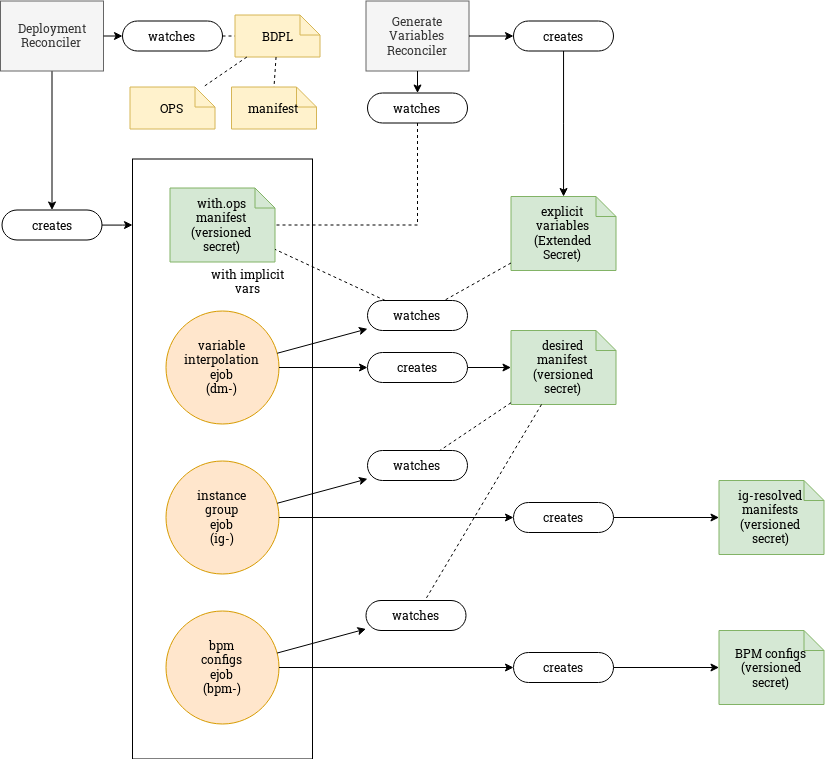
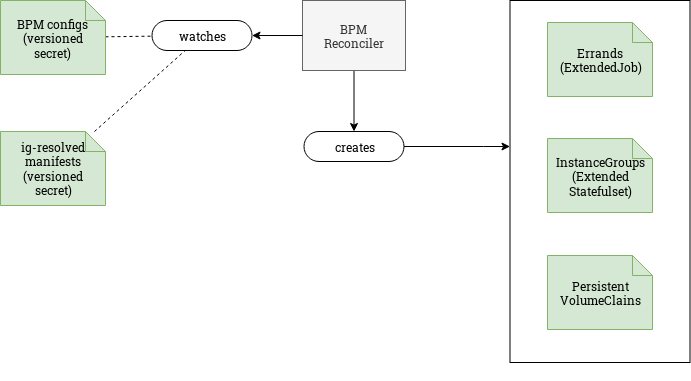

# BOSHDeployment

- [BOSHDeployment](#boshdeployment)
  - [Description](#description)
  - [Reconcilers](#reconcilers)
    - [Deployment Reconciler](#deployment-reconciler)
      - [Watches for](#watches-for)
      - [Creates/updates](#createsupdates)
    - [Generated Variable Reconciler](#generated-variable-reconciler)
      - [Watches for](#watches-for-1)
      - [Creates/updates](#createsupdates-1)
    - [BPM Reconciler](#bpm-reconciler)
      - [Watches for](#watches-for-2)
      - [Creates/updates](#createsupdates-2)
    - [Updates and Delete](#updates-and-delete)
    - [Update](#update)
    - [Delete](#delete)
  - [`BOSHDeployment` Examples](#boshdeployment-examples)

## Description

A BOSH deployment is created from a deployment manifest and optionally ops files.

The deployment manifest is based on a vanilla BOSH deployment manifest.
The ops files modify the deployment manifest. For example, ops files can be used to replace release tarballs with [docker images](https://ci.flintstone.cf.cloud.ibm.com/teams/containerization/pipelines/release-images), thus enabling deployment on Kubernetes.

A deployment is represented by the `boshdeployments.fissile.cloudfoundry.org` (`bdpl`) custom resource, defined in [`boshdeployment_crd.yaml`](https://github.com/cloudfoundry-incubator/cf-operator/tree/master/deploy/helm/cf-operator/templates/fissile_v1alpha1_boshdeployment_crd.yaml).
This [bdpl custom resource](https://github.com/cloudfoundry-incubator/cf-operator/tree/master/docs/examples/bosh-deployment/boshdeployment.yaml) contains references to config maps or secrets containing the actual manifests content.

After creating the bdpl resource on Kubernetes, i.e. via `kubectl apply`, the CF operator will start reconciliation, which will eventually result in the deployment
of the BOSH release on Kubernetes.

## Reconcilers

We use 3 controllers, and 3 separate reconciliation loops to deal with `BOSHDeployments`.

Here's a state diagram that tries to explain the process of reconciling a `BOSHDeployment`.

[edit](https://docs.google.com/drawings/d/126ExNqPxDg1LcB14pbtS5S-iJzLYPyXZ5Jr9vTfFqXA/edit?usp=sharing)

### Rendering manifests

### Converting To Kubernetes Resources

### Deployment Reconciler

#### Watches for

- `BOSHDeployment`
- `ConfigMap`/`Secret` for ops files and the deployment manifest

#### Creates/updates

- the "With Ops" `Secret`, that contains the deployment manifest, with all ops files applied
- the "Variable Interpolation"[auto-errand extended job](https://github.com/cloudfoundry-incubator/cf-operator/tree/master/docs/controllers/extendedjob.md#one-off-jobs-auto-errands)
- the "Data Gathering" auto-errand extended job
- the "BPM Configs" auto-errand extended job

> **Note**
>
> The output of the ["Variable Interpolation"](https://github.com/cloudfoundry-incubator/cf-operator/tree/master/docs/commands/cf-operator_util_variable-interpolation.md) `ExtendedJob` is the input for the "Data Gathering" `ExtendedJob`. This is the "Desired Manifest" `Secret`. (`desired-manifest-v1`)
>
> The ["Data Gathering"](https://github.com/cloudfoundry-incubator/cf-operator/tree/master/docs/commands/cf-operator_util_instance-group.md) step generates 2 [Versioned Secrets](extendedjob.md#versioned-secrets) for each Instance Group:
>
> - Instance Group Resolved Properties (referenced by the Instance Group `ExtendedStatefulSets` and `ExtendedJobs`) (i.e. `ig-resolved.nats-v1`)
> - Instance Group BPM (watched for by the BPM Reconciler) (i.e. `bpm.nats-v1`)
>

### Generated Variable Reconciler

This reconciler is responsible with auto-generating certificates, passwords and other secrets declared in the manifest. It does this with the help of `ExtendedSecrets`.

#### Watches for

- the "with-ops secret" (e.g. `nats-deployment.with-ops`)

#### Creates/updates

- `ExtendedSecret` for each explicit variable from the manifest

> **Note:** the `Secrets` generated by these `ExtendedSecrets` are referenced by the "Variable Interpolation" `ExtendedJob`.
> When these get created/updated, the "Variable Interpolation" job is run.

### BPM Reconciler

The BPM reconciler is triggered for each instance group in the desired manifest, since we generate one BPM Info Secret for each. The reconciler starts each Instance Group as its corresponding Secret is created. It *does not wait* for all Secrets to be ready.

> **Note**
>
> The Secrets watched by the BPM Reconciler are [Versioned Secrets](extendedjob.md#versioned-secrets).

#### Watches for

- the [Versioned Secrets](extendedjob.md#versioned-secrets) for Instance Group BPM information

#### Creates/updates

- actual BOSH Instance Group `ExtendedStatefulSets` and `ExtendedJobs`

### Updates and Delete

### Update

Resources are _applied_ using an **upsert technique** [implementation](https://godoc.org/sigs.k8s.io/controller-runtime/pkg/controller/controllerutil#CreateOrUpdate).

Any resources that are no longer required are deleted.

### Delete

As the `BOSHDeployment` is deleted, all owned resources are automatically deleted in a cascading fashion.

Persistent volumes are left behind.

## `BOSHDeployment` Examples

See https://github.com/cloudfoundry-incubator/cf-operator/tree/master/docs/examples/bosh-deployment
