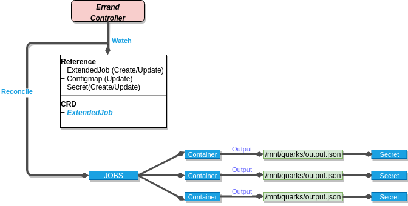
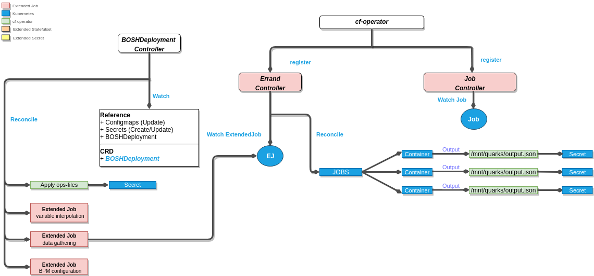

# ExtendedJob

- [ExtendedJob](#extendedjob)
  - [Description](#description)
  - [ExtendedJob Component](#extendedjob-component)
    - [Errand Controller](#errand-controller)
    - [Job Controller](#job-controller)
  - [Relationship with the BDPL component](#relationship-with-the-bdpl-component)
  - [ExtendedJob Examples](#extendedjob-examples)

## Description

An `ExtendedJob` allows the developer to run jobs when something interesting happens. It also allows the developer to store the output of the job into a `Secret`.
The job started by an `ExtendedJob` is deleted automatically after it succeeds.

There are two different kinds of `ExtendedJob`:

- **one-offs**: automatically runs once after it's created
- **errands**: needs to be run manually by a user

## ExtendedJob Component

The **ExtendedJob** component is a categorization of a set of controllers, under the same group. Inside the **ExtendedJob** component, we have a set of 2 controllers together with 2 separate reconciliation loops.

The following, is a **ExtendedJob** component diagram that covers the set of controllers it uses.

### **_Errand Controller_**

This is the controller responsible of implementing Errands, this will led to the generation of a Kubernetes job, in order to complete a task.

#### Watches

- `ExtendedJob` resources: Create and Update
- `ConfigMaps`: Update
- `Secrets`: Create and Update

#### Reconciliation

- When an `ExtendedJob` instance is generated, it will create Kubernetes Job.
- The generation of new Kubernetes Jobs, will serve also as the trigger for the `Job Controller`, to start the Reconciliation.

#### Highlights

##### Errands

- Errands are run manually by the user. They are created by setting `trigger.strategy: manual`.

- After the `ExtendedJob` is created, run an errand by editing and applying the
manifest, i.e. via `k edit errand1` and change `trigger.strategy: manual` to `trigger.strategy: now`. A `kubectl patch` is also a good way to trigger this type of `ExtendedJob`. After completion, this value is reset to `manual`.

##### Auto-Errands

- One-off jobs run directly when created, just like native k8s jobs.

- They are created with `trigger.strategy: once` and switch to `done` when
finished.

- If a versioned secret is referenced in the pod spec of an `ExtendedJob`, the most recent
version of that secret will be used when the batchv1.Job is created.

##### Restarting on Config Change

- Just like an `ExtendedStatefulSet`, a **one-off** `ExtendedJob` can
automatically be restarted if its environment/mounts have changed, due to a
`configMap` or a `secret` being updated. This also works for [versioned secrets](#versioned-secrets). This requires the attribute `updateOnConfigChange` to be set to true.

- Once `updateOnConfigChange` is enabled, modifying the `data` of any `ConfigMap` or `Secret` referenced by the `template` section of the job will trigger the job again.

### **_Job Controller_**

This is an auxiliary controller that relies on the Errand Controller output. It will be watching for Kubernetes Jobs that Succeded or Failed, and eventually it will generate Kubernetes secrets.

#### Watches

- `Jobs`: Succedded or Failed

#### Reconciliation

- Generate Kubernetes secrets(versioned them)

#### Highlights

##### Persisted Output

- The developer can specify a `Secret` where the standard output/error output of
the `ExtendedJob` is stored.

- One secret is created or overwritten per container in the pod. The secrets'
names are `<namePrefix>-<containerName>`.

- The only supported output type currently is json with a flat structure, i.e.
all values being string values.

- **Note:** Output of previous runs is overwritten.

- The behavior of storing the output is controlled by specifying the following parameters:
  - `namePrefix` - Prefix for the name of the secret(s) that will hold the output.
  - `outputType` - Currently only `json` is supported. (default: `json`)
  - `secretLabels` - An optional map of labels which will be attached to the generated secret(s)
  - `writeOnFailure` - if true, output is written even though the Job failed. (default: `false`)
  - `versioned` - if true, the output is written in a [Versioned Secret](#versioned-secrets)

##### Versioned Secrets

Versioned Secrets are a set of `Secrets`, where each of them is immutable, and contains data for one iteration. Implementation can be found in the [versionedsecretstore](https://github.com/cloudfoundry-incubator/cf-operator/blob/master/pkg/kube/util/versionedsecretstore) package.

When an `ExtendedJob` is configured to save to "Versioned Secrets", the controller looks for the `Secret` with the largest ordinal, adds `1` to that value, and _creates a new Secret_.

Each versioned secret has the following characteristics:

- its name is calculated like this: `<name>-v<ORDINAL>` e.g. `mysecret-v2`
- it has the following labels:
  - `fissile.cloudfoundry.org/secret-kind` with a value of `versionedSecret`
  - `fissile.cloudfoundry.org/secret-version` with a value set to the `ordinal` of the secret
- an annotation of `fissile.cloudfoundry.org/source-description` that contains arbitrary information about the creator of the secret

## Relationship with the BDPL component

The above image illustrates the interaction of the **BOSHDeployment** Controller with the **Errand** Controller and how the output of this one, serves as the trigger for the **Job** Controller.

## `ExtendedJob` Examples

See https://github.com/cloudfoundry-incubator/cf-operator/tree/master/docs/examples/extended-job
