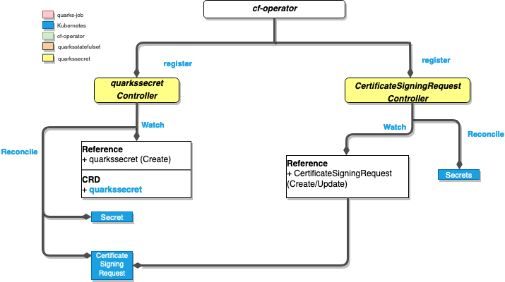
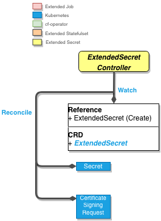
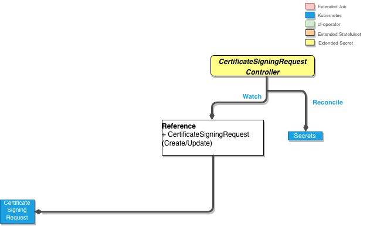
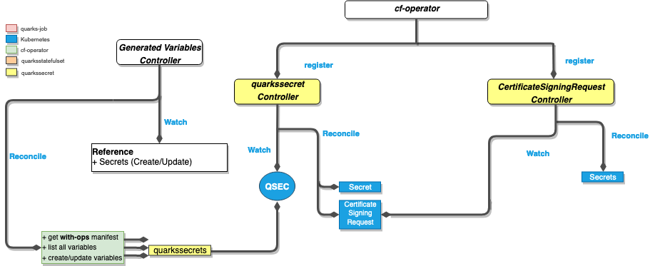

# ExtendedSecret

- [ExtendedSecret](#extendedsecret)
  - [Description](#description)
  - [ExtendedSecret Component](#extendedsecret-component)
    - [ExtendedSecret Controller](#extendedsecret-controller)
      - [Highlights](#highlights)
        - [Types](#highlights)
        - [Policies](#policies)
    - [CertificateSigningRequest Controller](#certificatesigningrequest-controller)
  - [Relationship with the BDPL component](#relationship-with-the-bdpl-component)
  - [`ExtendedSecret` Examples](#extendedsecret-examples)

## Description

ExtendedSecret generates passwords, keys and certificates and stores them in Kubernetes secrets.

## ExtendedSecret Component

The **ExtendedSecret** component is a categorization of a set of controllers, under the same group. Inside the **ExtendedSecret** component, we have a set of 2 controllers together with 2 separate reconciliation loops.

The following, is a **ExtendedSecret** component diagram that covers the set of controllers it uses.



### **_ExtendedSecret Controller_**



The ExtendedSecret Controller will get a list of all variables referenced in a BOSH manifest with ops files applied, and will use this list of variables to generate the pertinent ExtendedSecret instances.

#### Watches

- `ExtendedSecret`: Creation

#### Reconciliation

- generates Kubernetes secret of specific types(see Types under Highlights).
- generate a Certificate Signing Request against the cluster API.

#### Highlights

##### Types

Depending on the `spec.type`, `ExtendedSecret` supports generating the following:

| Secret Type                     | spec.type     | certificate.signerType | certificate.isCA    |
| ------------------------------- | ------------- | ---------------------- | ------------------- |
| `passwords`                     | `password`    | not set                | not set             |
| `rsa keys`                      | `rsa`         | not set                | not set             |
| `ssh keys`                      | `ssh`         | not set                | not set             |
| `self-signed root certificates` | `certificate` | `local`                | `true`              |
| `self-signed certificates`      | `certificate` | `local`                | `false`             |
| `cluster-signed certificates`   | `certificate` | `cluster`              | `false`             |

> **Note:**
>
> You can find more details in the [BOSH docs](https://bosh.io/docs/variable-types).

##### Policies

The developer can specify policies for rotation (e.g. automatic or not ) and how secrets are created (e.g. password complexity, certificate expiration date, etc.).

##### Auto-approving Certificates

A certificate `ExtendedSecret` can be signed by the Kube API Server. The ExtendedSecret Controller is be responsible for generating certificate signing request:

```yaml
apiVersion: certificates.k8s.io/v1beta1
kind: CertificateSigningRequest
metadata:
  name: generate-certificate
spec:
  request: ((encoded-cert-signing-request))
  usages:
  - digital signature
  - key encipherment
```

### **_CertificateSigningRequest Controller_**



#### Watches

- `Certificate Signing Request`: Creation

#### Reconciliation

- once the request is approved by Kubernetes API, will generate a certificate stored in a Kubernetes secret, that is recognized by the cluster.

#### Highlights

The CertificateSigningRequest controller watches for `CertificateSigningRequest` and approves ExtendedSecret-owned CSRs and persists the generated certificate.

## Relationship with the BDPL component



The above image illustrates the interaction of the **Generated Variables** Controller with the **ExtendedSecret** Controllers. The Generated Variables Controller when reconciling, will list all variables of a BOSH manifest(basically all BOSH variables), and generate for each an ExtendedSecret instance, which will trigger the following controller, the ExtendedSecret one.

## `ExtendedSecret` Examples

See https://github.com/cloudfoundry-incubator/cf-operator/tree/master/docs/examples/extended-secret
