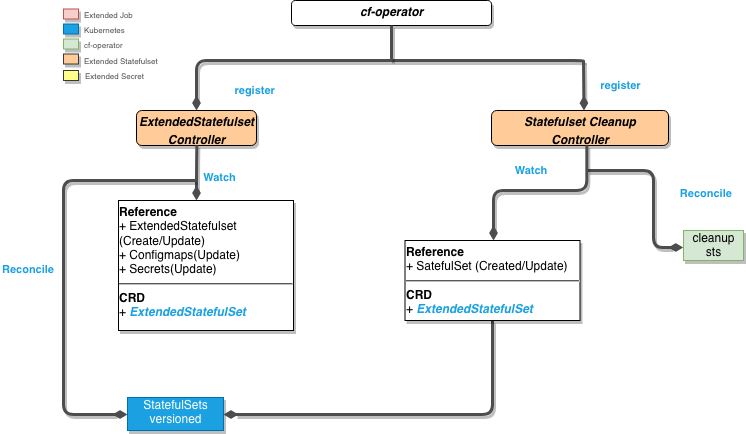
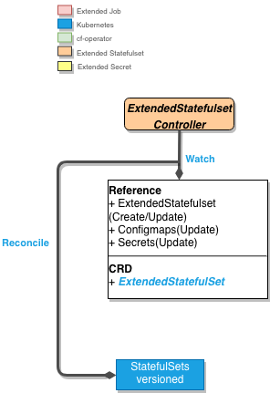
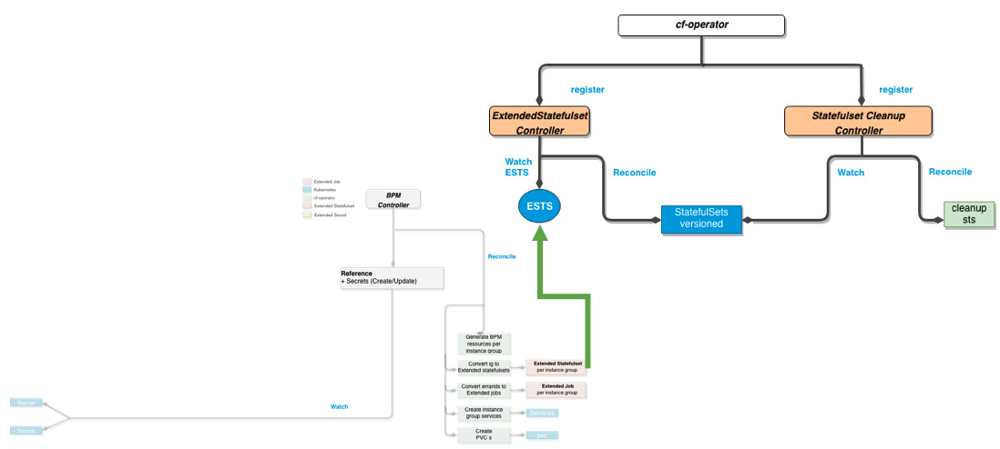

# ExtendedStatefulSet

1. [ExtendedStatefulSet](#ExtendedStatefulSet)
   1. [Description](#Description)
   2. [ExtendedStatefulset Component](#extendedstatefulset-component)
      1. [ExtendedStatefulset Controller](#extendedstatefulset-controller)
         1. [Watches](#watches-in-sts-controller)
         2. [Reconciliation](#reconciliation-in-sts-controller)
         3. [Scaling Restrictions (not implemented)](#scaling-restrictions-not-implemented)
         4. [Automatic Restart of Containers](#automatic-restart-of-containers)
         5. [Exposing ExtendedStatefulSets Publicly](#exposing-extendedstatefulsets-publicly)
         6. [Cluster IP](#cluster-ip)
         7. [Load Balancer](#load-balancer)
         8. [Ingress](#ingress)
         9. [Extended Upgrade Support](#extended-upgrade-support)
         10. [Detects if StatefulSet versions are running](#detects-if-statefulset-versions-are-running)
         11. [Volume Management](#volume-management)
         12. [AZ Support](#az-support)
      2. [Statefulset Cleanup Controller](#statefulset-cleanup-controller)
         1. [Watches](#watches-in-cleanup-controller)
         2. [Reconciliation](#reconciliation-in-cleanup-controller)
   3. [Relationship with the BPM component](#relationship-with-the-bdpl-component)
   4. [`ExtendedStatefulSet` Examples](#extendedstatefulset-examples)

## Description

The ExtendedStatefulSet component can be understood as the set of controllers responsible for translating the BOSH manifest `instance_groups` into Kubernetes resources.

## ExtendedStatefulset Component

The **ExtendedStatefulset** component is a categorization of a set of controllers, under the same group. Inside the **ExtendedStatefulset** component, we have a set of 2 controllers together with one separate reconciliation loop per controller.

Figure 1 illustrates a **ExtendedStatefulset** component diagram that covers the set of controllers it uses.


*Fig. 1: The ExtendedStatefulset component*

### **_ExtendedStatefulset Controller_**


*Fig. 2: The ExtendedStatefulset controller*

This controller will generate a Kubernetes statefulset for each instance_group defined in the BOSH manifest. This Statefulset will also include a set of Kubernetes services, so that each component can be accessed on specific ports.

#### Watches in sts controller

- `ExtendedStatefulset`: Creation
- `Configmaps`: Update
- `Secrets`: Update

#### Reconciliation in sts controller

Will generate versioned statefulsets with the required data to make all jobs of the instance_group runnable.

#### Scaling Restrictions (not implemented)

Ability to set restrictions on how scaling can occur: min, max, odd replicas.

#### Automatic Restart of Containers

When an env value or mount changes due to a `ConfigMap` or `Secret` change, containers are restarted.
The operator watches all the `ConfigMaps` and `Secrets` referenced by the `StatefulSet`, and automatically performs the update, without extra workarounds.

#### Exposing ExtendedStatefulSets Publicly

Exposing extendedstatefulsets is similar to exposing statefulsets in kubernetes. A kubernetes service makes use of labels to select the pods which should be in the service. We need to use two labels to group the pods of a single instance group.

1. fissile.cloudfoundry.org/instance-group-name: ((instanceGroupName))
2. fissile.cloudfoundry.org/deployment-name: ((deploymentName))

#### Cluster IP

Following is the example which creates a service with type ClusterIp for a single instance group named nats in deployment nats-deployment for exposing port 4222.

```bash
---
apiVersion: v1
kind: Service
metadata:
  name: nats-service
spec:
  type: ClusterIP
  selector:
    fissile.cloudfoundry.org/instance-group-name: nats
    fissile.cloudfoundry.org/deployment-name: nats-deployment
  ports:
    - protocol: TCP
      port: 80
      targetPort: 4222
```

Complete example can be found [here](https://github.com/cloudfoundry-incubator/cf-operator/tree/master/docs/examples/bosh-deployment/boshdeployment-with-service.yaml).

Though, by default, quarks creates three services of type ClusterIp as defined [here](https://github.com/cloudfoundry-incubator/cf-operator/blob/master/docs/from_bosh_to_kube.md#naming-conventions) for any instance group.

#### Load Balancer

For creating a service type LoadBalancer, we just need to change the .spec.type to LoadBalancer in the above example. The LoadBalancer Ingress is your public ip specified in the output of this command `kubectl describe service nats-service`.

#### Ingress

Ingress doesn't use any labels but just sits on top of services and acts as a smart router. You can create services of different types based on the above examples and use them as values in the ingress kubernetes spec. An example of Ingress can be found [here](https://kubernetes.io/docs/tasks/access-application-cluster/ingress-minikube/#create-an-ingress-resource)

For more information about kubernetes services, we recommend you to read [this](https://kubernetes.io/docs/concepts/services-networking/service/).

#### Extended Upgrade Support

When an update needs to happen, a second `StatefulSet` for the new version is deployed, and both coexist until canary conditions are met. This also allows support for Blue/Green techniques.

> **Note:**
>
> This could make integration with [Istio](https://istio.io/) easier and (more) seamless.

Annotated with a version (auto-incremented on each update). The annotation key is `fissile.cloudfoundry.org/version`.

Ability to upgrade even though `StatefulSet` pods are not ready.

#### Detects if StatefulSet versions are running

During upgrades, there is more than one `StatefulSet` version for an `ExtendedStatefulSet` resource. The operator lists available versions and keeps track of which are running.

A running version means that at least one pod that belongs to a `StatefulSet` is running. When a version **n** is running, any version lower than **n** is deleted.

The controller continues to reconcile until there's only one version.

#### Volume Management

The problem we're solving here is the following:

When we create an `ExtendedStatefulSet`, the version associated to it is **v1**. After an update, the `ExtendedStatefulSet` moves on to **v2** with a Blue/Green update strategy. The task is to replace the new `PersistentVolumeClaims` from the **v2** `StatefulSet` with the `PVCs` of **v1**. This is not something that the `StatefulSet` controller supports - it's always trying to recreate the replaced `PVCs` and reattach them to pods.

Our solution is to use a "dummy" `StatefulSet`(with the prefix "volume-management-") with the same replica count as the `ExtendedStatefulSet` replica count. We then wait for this "dummy" `StatefulSet` to generate the volumes that we need.
The final step is to remove the `volumeClaimTemplates` from the actual "desired" `StatefulSets` and mutate the pods so they use the volumes from the "dummy" `StatefulSet`.


*Fig. 3: Volume Claim management across versions*

#### AZ Support

The `zones` key defines the availability zones the `ExtendedStatefulSet` needs to span.

The `zoneNodeLabel` defines the node label that defines a node's zone.
The default value for `zoneNodeLabel` is `failure-domain.beta.kubernetes.io/zone`.

The example below defines an `ExtendedStatefulSet` that should be deployed in two availability zones, **us-central1-a** and **us-central1-b**.

```yaml
apiVersion: fissile.cloudfoundry.org/v1alpha1
kind: ExtendedStatefulSet
metadata:
  name: MyExtendedStatefulSet
spec:
  zoneNodeLabel: "failure-domain.beta.kubernetes.io/zone"
  zones: ["us-central1-a", "us-central1-b"]
  ...
  template:
    spec:
      replicas: 2
  ...
```

The `ExtendedStatefulSet` controller creates one `StatefulSet` version for each availability zone, and adds affinity information to the pods of those `StatefulSets`:

```yaml
affinity:
  nodeAffinity:
    requiredDuringSchedulingIgnoredDuringExecution:
      nodeSelectorTerms:
      - matchExpressions:
        - key: "failure-domain.beta.kubernetes.io/zone"
          operator: In
          values: ["us-central1-a"]
```

If zones are set for an `ExtendedStatefulSet`, the following occurs:

- The name of each created `StatefulSet` is generated as `<extended statefulset name>-z<index of az>-v<statefulset version>`.

  ```text
  myextendedstatefulset-z0-v1
  ```

- The `StatefulSet` and its `Pods` are labeled with the following:

  ```yaml
  fissile.cloudfoundry.org/az-index: "0"
  fissile.cloudfoundry.org/az-name: "us-central1-a"
  ```

- The `StatefulSet` and its `Pods` are annotated with an **ordered** JSON array of all the availability zones:

  ```yaml
  fissile.cloudfoundry.org/zones: '["us-central1-a", "us-central1-b"]'
  ```

- As defined above, each pod is modified to contain affinity rules.
- Each container and init container of each pod have the following env vars set:

  ```shell
  KUBE_AZ="zone name"
  BOSH_AZ="zone name"
  CF_OPERATOR_AZ="zone name"
  AZ_INDEX=="zone index"
  ```

#### Restarting on Config Change

`ExtendedStatefulSets` can be automatically updated when the environment/mounts have changed due to a referenced
`ConfigMap` or a `Secret` being updated. This behavior is controlled by the `updateOnConfigChange` flag which defaults to `false`.

### **_Statefulset Cleanup Controller_**


*Fig. 4: The Statefulset Cleanup controller*

#### Watches in cleanup controller

- `StatefulSet`: Creation/Update

#### Reconciliation in cleanup controller

It will delete statefulsets with old versions, only after the new statefulset version instances are up and running.

## Relationship with the BDPL component


*Fig. 5: Relationship with the BPM controller*

Figure 5 illustrates the interaction of the **BPM** Controller with the **ExtendedStatefulset** Controller. Once the BPM controller consumes the data persisted in secrets from the `ExtendedJob` Component, it will use that data to generate new `ExtendedStatefulset` instances. When these resources are generated, the ExtendedStatefulSet controller will be watching and trigger its reconciliation loop.

## `ExtendedStatefulSet` Examples

See https://github.com/cloudfoundry-incubator/cf-operator/tree/master/docs/examples/extended-statefulset
