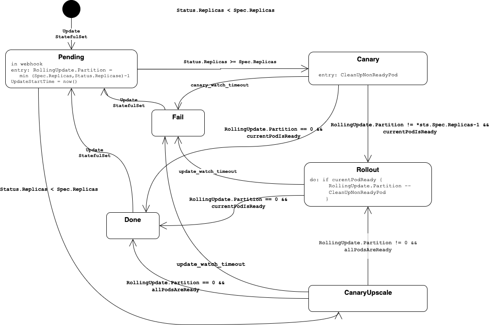

# StatefulSet Rollout

To implement the BOSH behaviour during rollout of a new manifest, an special controller is introduced.

## Motivation

The former implementation use a new `StatefulSet` for each new version of a manifest. This had the following drawbacks:

* Update on a cluster with multiple nodes was not working. When the new pods were started on a different node, the volume was blocked by the old pod.
* On a single node cluster this was also not working, if the workload (e.g. mysql) was using a lock on the volume on file-system level.

## Why standard K8s StatefulSet is not sufficient

* Out-of-order updates are possible when e.g. a pod/node crashes.
* Recovering from a failed deployment is not possible with the standard kubernetes `StatefulSet` controller.
* There is no timeout when the new deployment is rolled out and is stuck.

## Statemachine

This controller implements the following state machine

### Known Limitations

#### CanaryUpscale 

During upscale, there is no real canary behaviour implemented. 
If a `StatefulSet` is scaled from 3 to 5 replicas, the state changes to `CanaryUpscale` and `Partition` is set to 2. 
The k8s statefulset controller creates the 2 missing instances. 
If all instances are ready the controller switches to state `Rollout` and continues as usual.
Due to the fact that more than 1 instance might be updated in state `CanaryUpscale`, the `update-watch-time` is used as timeout.

#### Single Replica

The former implementation was starting a second pod during the update before shutting down the old one.
This is no longer possible as the name of the pod won't change and results in a downtime.